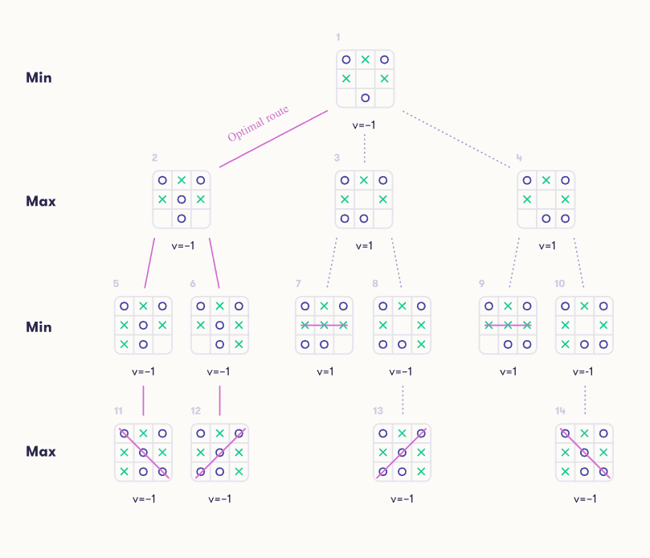
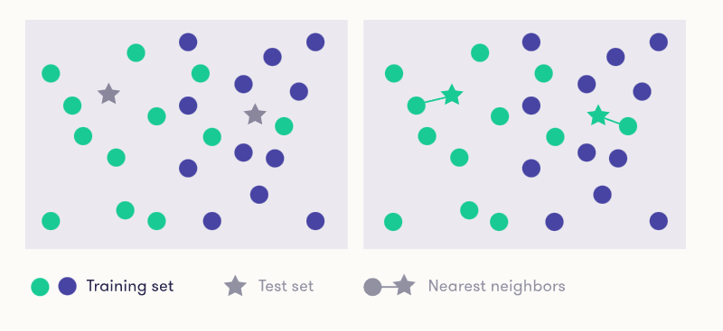
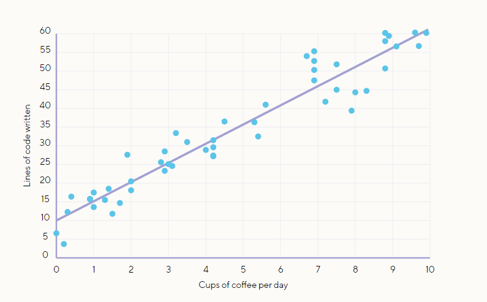

# Introduction

This is a repository with simple AI examples in Python, developed just for learning purposes.

# Game trees & Minimizing and maximizing value

Technique to solve games by representing each states as a node in a tree.
The idea is assigning a numeric value to each possible result, for example, a positive value when one player wins, a negative when the other wins, and zero in case of tie.
So from the final nodes to the beginning, each node will be assigned the result value. When there are different branches that reach to different results, we assign the value of the player who plays now.
Determining the winner is just a matter of choosing the optimal route.

# Odds and probability

Odds is a way of representing the probability. It's the number of times something may happen vs the times it won't happen.
Example:
- Probability of raining today: 75% or 0.75
- Odds: 3:1

(times something happens) : (times something doesn't happen)

## Prior and posterior odds & Bayers rule

Example:
- Rain probability in Spain: 40% or 4:6 (prior odds)
- Rain probability in Spain if clouds: 80% or 8:2 (posterior odds)

*Likelihood ratio*: it is the probability of the observation in case the event of interest (in the above, rain), divided by the probability of the observation in case of no event (in the above, no rain).

**Bayers rule**:

posterior odds = likelihood ratio of a new situation * prior odds

# Machine Learning

- Supervised Learning: given an input, the task is to predict the correct output or label (binary classification problems)
- Unsupervised Learning: no right outputs. The task is to discover the structure of the data, grouping similar items or reducing the data to a small number of important dimensions (data visualization or generative modeling)
- Reinforcement learning: the AI must operate in an environment and feedback of good or bad choices is not available in real time
- Mix, semisupervised learning

## Training vs test set

- Training data will be used for predicting test data
- Training data will be chosen and supervised in order to examine the accuracy of the predictions
- Test data won't affect future predictions

**Overfitting**: valid predictions for past results, but too tight for future situations.

## Nearest neighbor classifier

- Nearest: distance or similarity between instances
- Produces labels from a fixed set of alternatives (classes)
- Used for example to predict customer behaviors, similar to others who bought the same

## Linear Regression

- Produces numerical outputs
- An increment in the result when an input specification (coefficient or weight) is increased on a fixed quantity, is always the same
- The learning technique consists of finding the coefficients from data about tons of results

## Logistic regression

- A regresion which outputs are labels
- Using linear regresion takes the numerical output and predicts a specific label if the output is greater than zero, and another label if the output is less than or equal to zero
- It can also give a measure of uncertainty of the prediction

## Machine learning limits

- The hardness of the task: in handwritten digit recognition, if the digits are written very sloppily, even a human can’t always guess correctly what the writer intended
- The machine learning method: some methods are far better for a particular task than others
- The amount of training data: from only a few examples, it is impossible to obtain a good classifier
- The quality of the data

# Credits

Based on Elements of AI courses:
https://www.elementsofai.com/
